# TradeX — PRISM Protocol

**Price-Referenced Instant Settlement Mechanism** built on Uniswap V4 + Yellow Network

> _Like light through a prism, a single swap intent is refracted into two rays — a Price Ray and a Settlement Ray — that recombine at the destination._

---

## The Story

### The Problem: Cross-Border Remittance is Broken

Every day, millions of workers in the UAE send money home to India. A construction worker in Dubai earning AED 3,000/month wants to send AED 500 home. Today's options:

| Channel | Fee | Speed | Transparency |
|---------|-----|-------|-------------|
| Bank wire (SWIFT) | 3-5% + flat fee | 2-5 business days | Opaque FX rate |
| Western Union | 4-7% | Hours to 1 day | Hidden markup |
| Hawala (informal) | 1-2% | Fast | Illegal in many jurisdictions |
| Crypto (naive) | Gas fees + slippage | Minutes | Volatile pricing |

The core issue: **price discovery and settlement are coupled**. Every transfer touches an AMM pool, pays gas, suffers slippage, and leaves no auditable trail for compliance.

### The Insight: TradFi Already Solved This

In traditional finance, the **WM/Reuters FX Fixing** is a benchmark rate published at 4 PM London time. **$6.6 trillion per day** of forex trades settle at this rate — _without any of them actually touching the spot market_. The rate is the reference; settlement happens separately.

What if DeFi could work the same way?

### The Solution: PRISM — Refracted Execution

**PRISM** (Price-Referenced Instant Settlement Mechanism) separates the _what_ from the _how_:

```
                    User Intent
                   "100 INR → AED"
                        │
                   ┌────┴────┐
                   │  PRISM  │
                   └────┬────┘
              ┌─────────┴─────────┐
              ▼                   ▼
     🔷 PRICE RAY           ⚡ SETTLEMENT RAY
     Uniswap V4 Pool        Yellow Network
     (Base Sepolia)          State Channels
     │                       │
     │ sqrtPriceX96 →        │ Gasless, instant
     │ "1 AED = 22.727 INR"  │ transfer via Nitrolite
     │                       │ SDK (ERC-7824)
     └─────────┬─────────────┘
               ▼
     🔐 MERKLE ATTESTATION
     PRISMHook.captureAndAttest()
     On-chain proof on Base Sepolia
     │
     └─→ Anyone can verify: the settlement
         happened at the V4 fixing rate
```

**The Price Ray** reads the live `sqrtPriceX96` from a Uniswap V4 INR/AED pool on Base Sepolia. This is the _fixing rate_ — the provably fair, manipulation-resistant exchange rate computed by a real AMM with real liquidity.

**The Settlement Ray** executes the actual value transfer through Yellow Network's state channels. No gas. No slippage. Instant confirmation in ~2 seconds. The Nitrolite SDK (ERC-7824) handles WebSocket-based off-chain settlement.

**The Attestation** ties them together. A Merkle tree of all settlements is built, and its root is submitted to `PRISMHook.sol` on Base Sepolia via `captureAndAttest()`. This creates a permanent, on-chain proof that the settlement happened at the V4 fixing rate — auditable by anyone, forever.

### Why This Matters

| Traditional Swap | PRISM Swap |
|-----------------|------------|
| User pays gas ($2-50) | **Gasless** via state channels |
| Suffers AMM slippage | **Zero slippage** — settles at fixing rate |
| ~30 seconds | **~2 seconds** |
| No proof of fair pricing | **Merkle proof** on-chain |
| Single chain only | **Multi-chain**: Sepolia + Base Sepolia |
| Trust the exchange | **Trust the math**: V4 pool + Merkle tree |

### The Name

Like a physical prism refracts white light into a spectrum — revealing what was always there — TradeX PRISM refracts a swap intent into its constituent parts: price discovery and settlement. Each path is optimized independently, then recombined into a superior outcome.

---

## System Architecture


## Swap Flow


## Contract Architecture

```mermaid
graph LR
    subgraph Core["Core Protocol"]
        PH["PRISMHook.sol<br/>━━━━━━━━━━━━━━<br/>captureAndAttest()<br/>captureFixingRate()<br/>attestSettlement()<br/>verifySettlement()<br/>━━━━━━━━━━━━━━<br/>Epoch tracking<br/>Merkle verification<br/>Fixing rate TTL: 5min"]
    end

    subgraph Uniswap["Uniswap V4"]
        PM["PoolManager<br/>━━━━━━━━━━━━<br/>getSlot0()<br/>sqrtPriceX96"]
        Pool["INR/AED Pool<br/>━━━━━━━━━━━━<br/>fee: 3000<br/>tickSpacing: 60"]
    end

    subgraph Yellow["Yellow Network"]
        YA["YellowAdapter.sol<br/>━━━━━━━━━━━━━━<br/>openSession()<br/>closeSession()<br/>EIP-712 meta-tx"]
        NC["Nitrolite Custody<br/>━━━━━━━━━━━━━━<br/>deposit()<br/>State channels<br/>ERC-7824"]
    end

    subgraph Bridge["Bridge Layer"]
        TX["TradeX.sol<br/>━━━━━━━━━━━━<br/>fundBroker()<br/>sendHome()<br/>Orchestrator"]
        TB["TradeXBridge.sol<br/>━━━━━━━━━━━━<br/>HTLC swaps"]
        TO["TradeXOracle.sol<br/>━━━━━━━━━━━━<br/>INR/AED price"]
    end

    subgraph Tokens["Stablecoins"]
        INR["INR Stable<br/>ERC-20 · 6 dec"]
        AED["AED Stable<br/>ERC-20 · 6 dec"]
    end

    PH -->|"reads price"| PM
    PM --> Pool
    Pool --> INR
    Pool --> AED
    PH -->|"stores attestation"| PH
    YA -->|"manages sessions"| NC
    TX --> TB
    TX --> TO
    TX --> YA

    style Core fill:#1a1a2e,stroke:#7c4dff,color:#fff
    style Uniswap fill:#1a1a2e,stroke:#ff6f00,color:#fff
    style Yellow fill:#1a1a2e,stroke:#ffd600,color:#fff
    style Bridge fill:#1a1a2e,stroke:#00bfa5,color:#fff
    style Tokens fill:#1a1a2e,stroke:#4fc3f7,color:#fff
```



## Frontend Component Tree

```mermaid
graph TD
    App["app/page.tsx"] --> Providers["Providers.tsx<br/>wagmi + RainbowKit + QueryClient"]
    Providers --> Wallet["WalletButton.tsx<br/>Connect Wallet"]
    Providers --> Swap["SwapCard.tsx<br/>━━━━━━━━━━━━━━━━<br/>Main swap interface<br/>Token selection<br/>Amount input<br/>PRISM execution<br/>Attestation display"]
    Providers --> PD["ProjectDetails.tsx<br/>Protocol info panel"]

    Swap --> Contacts["ContactsManager.tsx<br/>Save/load addresses"]
    Swap --> ENS["ENSProfile.tsx<br/>Avatar + name resolution"]

    Swap --> PS["prismService.ts<br/>━━━━━━━━━━━━━━<br/>captureFixingRate()<br/>recordSettlement()<br/>createAttestation()<br/>buildMerkleTree()"]
    Swap --> PHS["prismHookService.ts<br/>━━━━━━━━━━━━━━<br/>captureAndAttest ABI<br/>getPoolKey()<br/>formatAttestation()"]
    Swap --> YN["useYellowNetwork.ts<br/>━━━━━━━━━━━━━━<br/>connect()<br/>deposit()<br/>transfer()<br/>getBalance()"]
    Swap --> UC["useContacts.ts<br/>━━━━━━━━━━━━━━<br/>localStorage-based<br/>address book"]

    PS --> V4S["uniswapV4Service.ts<br/>━━━━━━━━━━━━━━<br/>getPoolState()<br/>getSwapQuote()<br/>getPoolId()"]
    YN --> YNL["yellowNetwork.ts<br/>━━━━━━━━━━━━━━<br/>Nitrolite SDK<br/>WebSocket client<br/>State channel ops"]

    style App fill:#0d1117,stroke:#58a6ff,color:#c9d1d9
    style Swap fill:#0d1117,stroke:#3fb950,color:#c9d1d9
    style PS fill:#0d1117,stroke:#d2a8ff,color:#c9d1d9
    style YN fill:#0d1117,stroke:#f97583,color:#c9d1d9
```



---

## Key Features

| Feature | Description |
|---------|-------------|
| **Uniswap V4 Pricing** | Real-time `sqrtPriceX96` from on-chain INR/AED pool as fixing rate |
| **Yellow Network Settlement** | Gasless, instant transfers via ERC-7824 state channels (Nitrolite SDK) |
| **PRISM Attestations** | Merkle proofs auto-submitted on-chain via `PRISMHook.captureAndAttest()` |
| **ENS Support** | Send to `.eth` names with avatar/profile resolution |
| **Contacts System** | Save & manage recipient addresses with ENS labels |
| **Multi-Chain** | Sepolia (Yellow Network) ↔ Base Sepolia (V4 + PRISMHook) with auto-switch |
| **Merkle Verification** | Anyone can verify any settlement against the on-chain attestation |

## Tech Stack

| Layer | Technology |
|-------|-----------|
| **Smart Contracts** | Solidity ^0.8.26, Hardhat, Uniswap V4 Core |
| **Frontend** | Next.js 16, React 19, TypeScript, TailwindCSS |
| **Web3** | wagmi v3, viem v2, RainbowKit |
| **State Channels** | Yellow Network, Nitrolite SDK (`@erc7824/nitrolite`) |
| **Settlement Proofs** | Merkle trees, keccak256 attestations |
| **Cryptography** | sqrtPriceX96 → rate conversion, EIP-712 signatures |

---

## Deployed Contracts

### Base Sepolia (Chain ID: 84532)

| Contract | Address |
|----------|---------|
| **PRISMHook** | [`0x875C879f19E3DcE7D7Eb8e4871DcCb030d067992`](https://sepolia.basescan.org/address/0x875C879f19E3DcE7D7Eb8e4871DcCb030d067992) |
| **AED Stable** | [`0xd16B4e66c77048D68e6438068AfBBf4c96506d7F`](https://sepolia.basescan.org/address/0xd16B4e66c77048D68e6438068AfBBf4c96506d7F) |
| **INR Stable** | [`0xed7D8f68d65F07275E162b1B7d8D9c95dF4af48a`](https://sepolia.basescan.org/address/0xed7D8f68d65F07275E162b1B7d8D9c95dF4af48a) |
| **TradeX V4 Router** | [`0x20f91dAB56838b879B95A0318476DEe96C0e792C`](https://sepolia.basescan.org/address/0x20f91dAB56838b879B95A0318476DEe96C0e792C) |
| **V4 PoolManager** | [`0x05E73354cFDd6745C338b50BcFDfA3Aa6fA03408`](https://sepolia.basescan.org/address/0x05E73354cFDd6745C338b50BcFDfA3Aa6fA03408) |
| **INR/AED Pool** | `0x33ee81b5...912af281` (1 AED = 22.727 INR) |

### Sepolia (Chain ID: 11155111)

| Contract | Address |
|----------|---------|
| **Yellow Adapter** | [`0xB023452797871f3a201B174F2F1E113cE6E1796F`](https://sepolia.etherscan.io/address/0xB023452797871f3a201B174F2F1E113cE6E1796F) |
| **TradeX** | [`0x7Da12fF9d34Dc7F7AB14955d197A2C565a92f1ab`](https://sepolia.etherscan.io/address/0x7Da12fF9d34Dc7F7AB14955d197A2C565a92f1ab) |
| **INR Stable** | [`0x836879FAFF6d2ce51412A0ebf7E428e9cb87cD41`](https://sepolia.etherscan.io/address/0x836879FAFF6d2ce51412A0ebf7E428e9cb87cD41) |
| **AED Stable** | [`0x56abb7f9Fcf60892b044a2b590cD46B8B87C2E3c`](https://sepolia.etherscan.io/address/0x56abb7f9Fcf60892b044a2b590cD46B8B87C2E3c) |

---

## Project Structure

```
TradeX/
├── contracts/                  # Solidity smart contracts
│   ├── PRISMHook.sol          # V4 Hook: fixing rates + settlement attestations
│   ├── TradeX.sol             # Main orchestrator (INR↔AED bridge)
│   ├── TradeXBridge.sol       # HTLC atomic swaps
│   ├── TradeXOracle.sol       # INR/AED price feeds
│   ├── YellowAdapter.sol      # Yellow Network session management
│   ├── TradeXV4Router.sol     # Uniswap V4 swap router
│   ├── SimpleV4Router.sol     # Simplified V4 router
│   ├── ComplianceGuard.sol    # KYC/FEMA gates
│   └── MockERC20.sol          # Test tokens (INR, AED, USDC)
│
├── frontend/                   # Next.js 16 frontend
│   └── src/
│       ├── app/               # Next.js app router
│       ├── components/
│       │   ├── SwapCard.tsx   # Main swap UI with PRISM integration
│       │   ├── ContactsManager.tsx  # Address book management
│       │   ├── ENSProfile.tsx       # ENS name/avatar display
│       │   ├── WalletButton.tsx     # RainbowKit wallet connect
│       │   └── ProjectDetails.tsx   # Protocol info panel
│       ├── hooks/
│       │   ├── useYellowNetwork.ts  # Yellow Network SDK integration
│       │   ├── useContacts.ts       # Contacts/address book hook
│       │   └── useEnsTexts.ts       # ENS text record resolution
│       ├── lib/
│       │   ├── prismService.ts      # PRISM fixing rates + attestations
│       │   ├── prismHookService.ts  # PRISMHook contract interaction
│       │   ├── uniswapV4Service.ts  # V4 pool state + quotes
│       │   ├── yellowNetwork.ts     # Yellow Network client
│       │   └── run_yellow.mjs       # Yellow Network test script
│       └── providers/              # Wagmi + RainbowKit providers
│
├── scripts/                    # Deployment & utility scripts
├── deployments/               # Deployment addresses (JSON)
└── hardhat.config.js          # Hardhat configuration
```

---

## Getting Started

### Prerequisites

- Node.js ≥ 18
- MetaMask wallet with Sepolia & Base Sepolia ETH
- Yellow Network credentials (for state channel settlement)

### 1. Install Dependencies

```bash
# Root (smart contracts)
npm install

# Frontend
cd frontend
npm install
```

### 2. Environment Setup

Create `.env` in the root directory:

```env
DEPLOYER_PRIVATE_KEY=your_deployer_private_key
SEPOLIA_RPC_URL=https://rpc.ankr.com/eth_sepolia
BASE_SEPOLIA_RPC_URL=https://sepolia.base.org
```

### 3. Compile Contracts

```bash
npx hardhat compile
```

### 4. Run Frontend

```bash
cd frontend
npm run dev
```

Open [http://localhost:3000](http://localhost:3000) in your browser.

### 5. Connect & Swap

1. Connect wallet via RainbowKit (Sepolia network)
2. You'll receive test INR/AED tokens automatically via faucet
3. Enter amount and recipient (address or ENS name)
4. Execute swap — settlement happens instantly via Yellow Network
5. Attestation auto-submits to PRISMHook on Base Sepolia (auto chain-switch)

---

## How PRISM Works Under the Hood

### PRISMHook Contract

The `PRISMHook.sol` contract is the heart of the attestation layer:

```solidity
// Single-tx: capture V4 price + attest settlement
function captureAndAttest(
    PoolKey calldata key,
    bytes32 merkleRoot,
    uint256 settlementCount,
    uint256 totalVolume
) external onlyRelayer returns (uint256 epoch, bytes32 attestationId)
```

What it does atomically:
1. Reads live `sqrtPriceX96` from Uniswap V4 PoolManager
2. Increments epoch and stores the fixing rate
3. Creates a settlement attestation with the Merkle root
4. Emits `PrismFixingRate` and `SettlementAttested` events

Key parameters:
- Fixing rate TTL: **5 minutes** (configurable)
- Only authorized relayers can submit attestations
- Each attestation is a unique `attestationId = keccak256(poolId, epoch, merkleRoot, timestamp)`

### Merkle Tree Construction

```
            Merkle Root
           /           \
        H(0,1)        H(2,3)
       /     \        /     \
    leaf0   leaf1  leaf2   leaf3
      |       |      |       |
   keccak256(sender, recipient, amountIn, amountOut)
```

Each settlement is hashed into a leaf. The tree root is submitted on-chain. Anyone with the leaf data and proof path can verify a specific settlement occurred at the attested fixing rate.

### Analogy: TradFi FX Fixing

| WM/Reuters (TradFi) | PRISM (DeFi) |
|---------------------|-------------|
| Benchmark rate at 4 PM London | V4 `sqrtPriceX96` at swap time |
| $6.6T/day settles at fixing | Yellow Network settles at fixing |
| Published by Reuters/Refinitiv | Published by Uniswap V4 AMM |
| Audit trail in central ledger | Merkle attestation on Base Sepolia |
| Batch settlement end-of-day | Epoch-based batching (real-time) |

---

## Deployment Scripts

```bash
# Deploy PRISMHook to Base Sepolia
npx hardhat run scripts/deploy-prism-hook.js --network baseSepolia

# Authorize a wallet as relayer
npx hardhat run scripts/authorize-relayer.js --network baseSepolia

# Test captureAndAttest
npx hardhat run scripts/test-capture-and-attest.js --network baseSepolia

# Debug PRISMHook
npx hardhat run scripts/debug-full-prism.js --network baseSepolia
```

## Yellow Network Integration

TradeX uses [Yellow Network](https://yellow.org) for instant, gasless settlement via ERC-7824 state channels:

1. **Session Opening** — User opens a state channel with collateral
2. **Off-Chain Trading** — Transfers happen instantly via WebSocket (zero gas)
3. **Settlement** — Channel closes, final balances settle on-chain

The Nitrolite SDK (`@erc7824/nitrolite`) handles:
- WebSocket connection to Yellow Network clearnode
- State channel message signing and verification
- Transfer execution and confirmation (~2 seconds)

---

## License

ISC
